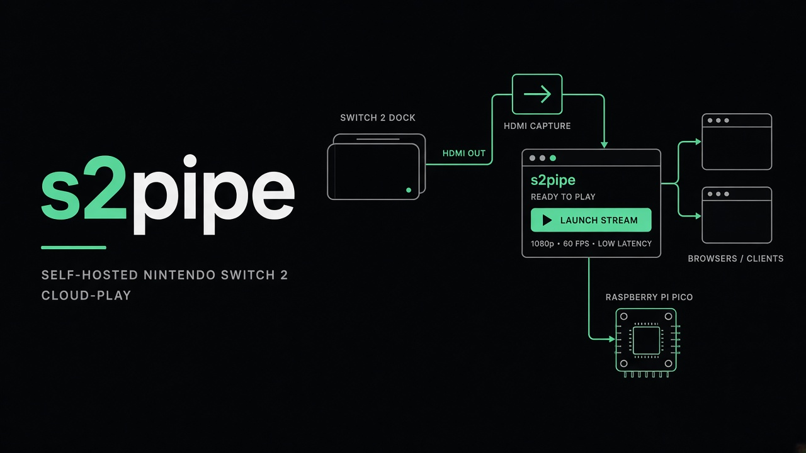

# s2pipe

Self-hosted Switch 2 cloud play. The console stays on the capture PC. Up to four browsers see the picture over WebRTC
and play with a gamepad or keyboard. Inputs go to a Raspberry Pico that shows up on the Switch as 4 USB pads.

No cloud, no subscription, no client to install. **No auth.** Trusted LAN only. Do not expose this on the Internet.

The **s2pipe launcher** (Windows and Linux) is the supported way to run it. It downloads FFmpeg and MediaMTX, starts
Node and the browser UI, and talks to the Pico.



```
Switch 2 --HDMI--> capture --USB--> launcher (FFmpeg + MediaMTX + node + client)
                                         |-- ICE --> browsers
Browsers --WHEP + WebSocket--> node --UART--> Pico --USB--> Switch 2
```

| Piece        | Path          | Role                                     |
| ------------ | ------------- | ---------------------------------------- |
| **Launcher** | `launcher`    | GUI / CLI: configure and run the stack   |
| **Node**     | `apps/node`   | HTTP, WebSocket, Pico serial, WHEP proxy |
| **Client**   | `apps/client` | Browser UI                               |
| **Firmware** | `firmware`    | Pico: UART in, 4 USB pads out            |

## 1. Tested hardware

Equivalents are fine.

- [Raspberry Pico 2 W](https://amzn.eu/d/09YZSwVw), board `pico2_w`
- [CP2102 UART adapter HW-598](https://amzn.eu/d/0catDsov), jumper **3.3 V**, **no VCC** on the Pico (TX / RX / GND
  only)
- [XIIXMASK HDMI USB 3.0 capture](https://amzn.eu/d/09Xc9GcE), UVC webcam, HDMI in + loop
- Switch 2 + dock, a Windows or Linux PC

## 2. Install the launcher

Download the Windows or Linux build from [Releases](https://github.com/8borane8/s2pipe/releases). Run it. First start
fetches FFmpeg, MediaMTX, and Deno into `~/.s2pipe/bins/`.

## 3. Flash the Pico

1. Download `s2pipe-pico-<version>.uf2` from [Releases](https://github.com/8borane8/s2pipe/releases) (no SDK needed).
2. Hold **BOOTSEL**, plug the Pico into the PC, drop the `.uf2`.
3. Unplug. Pico USB -> Switch dock. UART -> PC.

Local build: [firmware/README.md](firmware/README.md).

## 4. Wiring

One native USB: flash from the PC, then plug into the dock. Not a COM port and pads at the same time.

```
Node --UART 921600--> Pico GP5 RX / GP4 TX
Switch dock USB  --> Pico USB
```

| Pico     | Goes to                            |
| -------- | ---------------------------------- |
| USB      | Switch 2 dock (USB-A or USB-C OTG) |
| GP4 (TX) | UART adapter **RX**                |
| GP5 (RX) | UART adapter **TX**                |
| GND      | GND                                |

Power from Switch USB. **Leave adapter VCC disconnected** (5 V on a GPIO kills the Pico). CP2102 jumper on **3.3 V**.
UART **921600 8N1**.

## 5. Run

Open the launcher.

1. Pick the HDMI capture card, or **Test** (color bars, no hardware).
2. Pick HDMI audio if you want sound.
3. Pick the Pico serial port, or leave **None** for video only.
4. **This PC only** or **LAN** (set this PC's address so other devices can reach it).
5. Click **Start s2pipe**.

Open [http://localhost:5000](http://localhost:5000). On another LAN device, use the node address you set.

Optional: **Launch at startup** starts s2pipe in the background on login (no window). Closing the launcher does not stop
the stack; use Stop or `s2pipe stop`.

No window: use the **CLI**. Flags overlay `~/.s2pipe/config.json` for that run (defaults if there is no saved file).

```sh
s2pipe start
s2pipe start --capture-source test --pico-serial COM3
s2pipe stop
s2pipe start --help
```

## 6. Play

Start in **Watch**. **Play** takes a Pico seat (max 4). **Watch** releases it. Pick a gamepad at the bottom. Esc =
settings. The HUD stays on until fullscreen.

Pills: capture, Pico, WebSocket. `n/4 playing` is remote Pico seats, not Switch player numbers.

## 7. Sleep wake

The Pico 2 W can pull the Switch 2 out of **sleep** (not a full power-off) while a browser is on the play page. Switch 1
Joy-Con / Pro Controller cannot wake a Switch 2. You need a **Joy-Con 2 / Pro 2 / NSO GameCube** already paired with
that console. The console does **not** show its BT MAC in settings; the pad broadcasts it.

1. Pair the pad with the Switch 2 once (normal Nintendo pairing).
2. Put the Switch to **Sleep**. Detach the Joy-Con, or press a button on the Pro 2.
3. In the launcher, click **Listen for controller**.
4. Flash a **`pico2_w`** build. Open the play page (Watch is enough).

If the scan finds no Switch MAC, the pad was not advertising the console address. Sleep the Switch, detach the pad,
stand closer, retry.

The Pico LED stays on, and blinks only while the wake advert is on air.

## Ports

| Port     | What                                |
| -------- | ----------------------------------- |
| 5000     | Client                              |
| 5050     | Node: health, WebSocket, WHEP proxy |
| 8189 UDP | WebRTC ICE / RTP                    |

## Development

Deno workspace: `apps/node`, `apps/client`, `shared`. Firmware is CMake. Launcher is Tauri 2 (`launcher/`).

```sh
deno fmt
deno check apps/node/src/index.ts
deno check apps/client/src/index.ts
```

**Launcher:** `cd launcher && deno task dev`

**Node:** `cd apps/node && deno task dev` (5050). `PICO_SERIAL=/dev/ttyUSB0` or `COM3`.

**Client:** `cd apps/client && deno task dev` (5000). No `NODE_BASE_URL` -> connect page.

Firmware and packet: keep `apps/node/src/utils/packet.ts` in sync with `firmware/packet.h`.

## Node API

| Route                     | What                                                         |
| ------------------------- | ------------------------------------------------------------ |
| `GET /health`             | Capture, Pico, `playing` count                               |
| `GET /socket`             | WebSocket                                                    |
| `POST /switch/whep`       | Video WHEP; `PATCH` / `DELETE` `/switch/whep/:session`       |
| `POST /switch-audio/whep` | Audio WHEP; `PATCH` / `DELETE` `/switch-audio/whep/:session` |

- Client: `{ op: "play" }` / `{ op: "watch" }` / `{ op: "pad", data: PadState }`
- Server: `{ op: "status", data: { capture, pico, playing } }` on join and when seats change
- Server: `{ op: "play", data: { playing: boolean } }` after Play (`false` if all four seats are taken)

Join is Watch. Play takes a seat; Watch or closing the socket releases it.

## License

[MIT](LICENCE) Copyright (c) 2026-present, Borane
